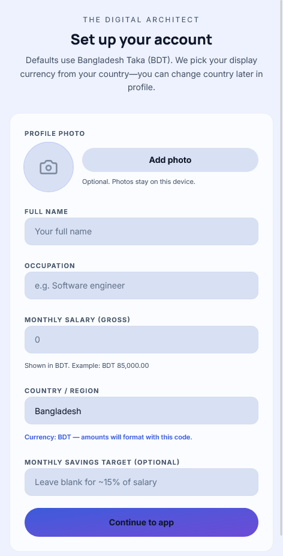
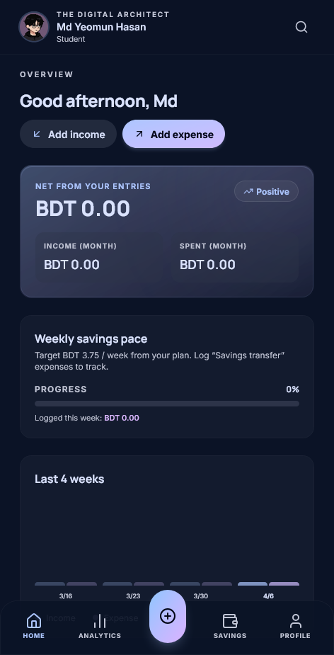
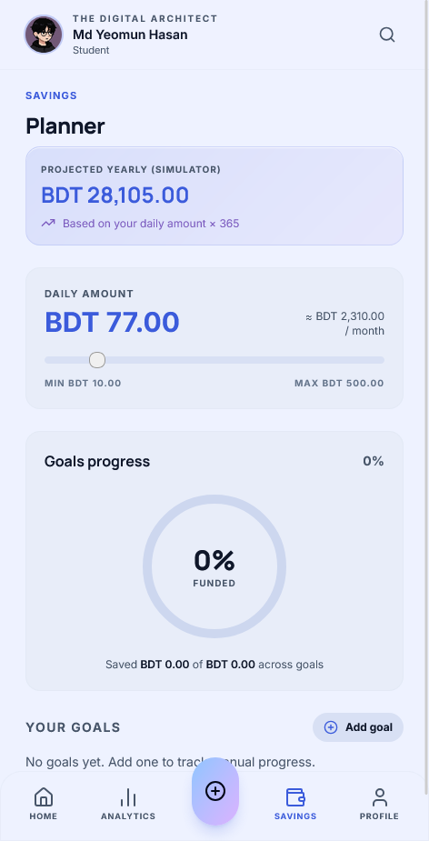

# The Digital Architect

**The Digital Architect** is a mobile-first personal finance web app: onboard with your profile, track income and expenses, see analytics, plan savings goals, and switch **light / dark / system** theme. Data stays in your browser (`localStorage`). Currency follows **country** (Bangladesh defaults to **BDT**).

**Repository:** [github.com/feehabcore/thedigitalarchitect](https://github.com/feehabcore/thedigitalarchitect)

## Download APK

- **Latest APK (direct):** [Download thedigitalarchitect-latest-debug.apk](https://github.com/feehabcore/thedigitalarchitect/releases/latest/download/thedigitalarchitect-latest-debug.apk)
- **All release assets:** [GitHub Releases](https://github.com/feehabcore/thedigitalarchitect/releases)

For the direct link to work, attach an APK named **`thedigitalarchitect-latest-debug.apk`** to your [latest GitHub Release](https://github.com/feehabcore/thedigitalarchitect/releases) (rename `app-debug.apk` from a local or [Actions](https://github.com/feehabcore/thedigitalarchitect/actions/workflows/android-apk.yml) build). Until a release exists, use **Releases** or **Actions → Artifacts**.

## Screenshots

| Account setup | Home overview | Savings planner |
| :---: | :---: | :---: |
|  |  |  |

## Features

- Onboarding: full name, occupation, salary, country (currency), optional savings target, optional profile photo
- Transactions, search, analytics (Recharts), savings simulator and goals
- Global search and add-transaction sheet
- Theme: Light, Dark, or match device

## Run locally

**Prerequisites:** [Node.js](https://nodejs.org/) (LTS recommended)

1. Install dependencies:

   ```bash
   npm install
   ```

2. *(Optional)* For Gemini-related features, copy `.env.example` to `.env.local` and set `GEMINI_API_KEY`.

3. Start the dev server:

   ```bash
   npm run dev
   ```

4. Open the URL shown in the terminal (default Vite port in this project: **3000**).

## Build

```bash
npm run build
```

Output is written to `dist/`.

## License

MIT — see [LICENSE](LICENSE).
